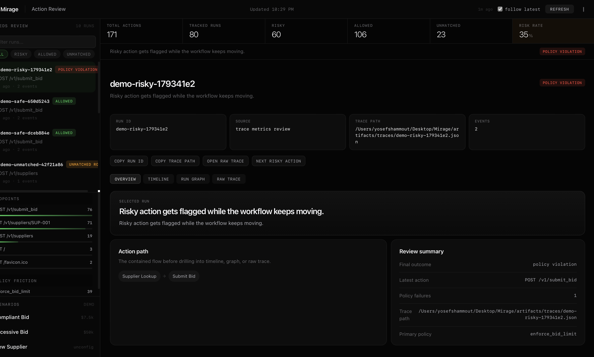

# Mirage

**Mirage is the deterministic policy runtime for AI agents. Same policy file gates your CI build and enforces in production. No LLM in the decision loop.**



_Screenshot: Mirage review console over a risky procurement run trace._

[](https://github.com/ysham123/Mirage/actions/workflows/ci.yml)
[](https://pypi.org/project/mirage-ci/)
[](https://pypi.org/project/mirage-ci/)
[](LICENSE)

Mirage sits between an agent and the rest of the world. Every outbound action is evaluated against a portable policy DSL and decided deterministically — allow, block, or flag. The same `policies.yaml` runs in CI to catch regressions before merge and in production to enforce containment in real time.

## Why Mirage exists

Agents do not just generate text. They submit bids, mutate billing systems, file
tickets, push code, and call APIs that move money. A bad retry, hallucinated
route, or out-of-policy payload can charge a customer twice, leak data across
tenants, or ship a regression that only surfaces after deploy.

Existing safety tooling either grades outputs with an LLM judge — flaky,
stochastic, and unsafe to fail-build a CI run on — or bundles into one
framework or one cloud, with the lock-in that implies. Mirage is the
deterministic, framework-agnostic layer underneath: a policy DSL that runs the
same file in CI and in production, with no model in the decision loop.

## Positioning

Mirage is the deterministic policy runtime for AI agents. The same policy file
runs in two modes:

- **CI mode** — agent runs against mocked responses, every action evaluated,
  deterministic trace emitted, build fails on policy regression
- **Gateway mode** — agent runs against real upstreams, every action evaluated,
  deterministic trace emitted, configurable enforcement (passthrough+log or
  hard-block on violation)

One policy file. Two modes. The decision is rule-based; no LLM judges, no
stochastic verdicts.

## How Mirage is different

The agent-safety landscape splits into three buckets. Mirage sits in a fourth.

- **Quality eval** (LangSmith, Braintrust, Patronus, Galileo, Maxim, Arize, Future AGI):
  graders that score whether a model's *output* was good. They run an LLM judge
  in the loop. Useful for response quality. Cannot deterministically fail a CI
  build, cannot ground a SOC2/HIPAA control. Mirage doesn't compete; it sits
  one layer down — agent *actions*, not response quality, evaluated by *rules*,
  not models.

- **Observability** (Sentrial, Laminar, Helicone, Langfuse, Lucidic):
  passive watching. Tells you what happened. Doesn't enforce. Mirage is
  enforcement.

- **Bundled framework guardrails** (Microsoft Agent Governance Toolkit,
  OpenAI Agents SDK callbacks, NeMo Guardrails, LangChain callbacks):
  shipped inside one framework or one cloud. Useful if you live entirely
  inside that vendor's stack. Mirage is framework-agnostic — the same
  `policies.yaml` runs against any agent that crosses an HTTP boundary you
  control.

- **Deterministic policy runtime** — the layer Mirage occupies. A portable
  policy DSL, evaluated by rules, that runs the same file in CI (against
  mocks) and in production (against real upstreams). No LLM in the decision
  loop. This is the line none of the above can say.

### Direct comparisons

- **Salus, Playgent, Cascade, Clam (YC agent-infra cohort)** — adjacent and
  uncrowded, but each ships a different shape. Salus is a runtime engine that
  wraps and checks actions; Mirage is the portable policy *language* that
  sits above the engine. Playgent is sandbox+mocks for testing; Mirage runs
  the same policy file in test and in production. Cascade learns from
  observed failures; Mirage enforces declarative rules. Clam is a
  network-layer firewall with prompt-injection scanning; Mirage is a policy
  DSL one layer up.

- **Microsoft Agent Governance Toolkit (April 2026, MIT)** — covers OWASP
  Top 10 agentic risks with framework-bundled SDK helpers (LangChain,
  CrewAI, LangGraph, OpenAI Agents SDK). Excellent if you live inside the
  Azure/MSFT stack. Mirage is the framework-agnostic alternative: same
  policy file, any framework, any cloud, deterministic decisions, exportable
  policy artifacts that survive a stack migration.

- **Future AGI** — closed-loop agent platform with simulation, eval,
  observability, and "Protect" guardrails. Their evaluation surface is
  LLM-judged (hallucination, factuality, toxicity scores). Mirage is the
  opposite category: deterministic action policies, not LLM-graded outputs.
  Different buyer, different decision class, different SLA shape.

- **Runtime LLM-judge guards** (Llama Guard, policy agents that prompt a
  model to decide allow/block) — arbitrate via a model. Mirage arbitrates
  via rules. CI can deterministically gate on rules; it can't on judges.

### Dev-tool overlap

Mirage's CI mode looks superficially like HTTP-mocking libraries. The wedge
is run-scoped policy enforcement, not per-test response stubbing:

- **pytest-httpx / respx** — per-test `httpx` mocking with response stubs.
  Mirage is run-scoped: one `MirageSession` spans an entire agent run,
  enforces a declarative policy file (not just response stubs), and writes a
  trace you can gate CI on via `assert_clean()` or `mirage gate-run`.
- **VCR.py** — record-and-replay cassettes. Mirage does not record; it
  evaluates against a policy so a brand-new risky action is caught on its
  *first* appearance, not only after a cassette exists.
- **WireMock / mitmproxy** — general-purpose mock servers and intercepting
  proxies. Mirage is narrower: declarative policy + deterministic decision +
  trace, tuned for agent action review.

### When not to use Mirage today

- Your agent doesn't cross an HTTP boundary you control (direct DB writes,
  filesystem mutation, subprocess calls — none of those go through Mirage
  yet).
- Your decision criteria are inherently subjective ("did the answer sound
  right?") — that's an LLM-judge problem, not a policy-rule problem.
- You have no CI step that can run the agent and no staging environment that
  can route through a gateway — Mirage's value is enforcement at one of
  those two boundaries.

> Status: `v0.1.3` ships the **CI mode** of the policy runtime — `MirageSession`,
> `mirage gate-run`, the procurement harness, and the review console. The
> **gateway mode** (production passthrough + enforcement against the same
> policy file) is the next release on the roadmap. The mission is the
> deterministic policy runtime; v0.1 is the first half of that runtime
> shipped to PyPI today.

## See It In 60 Seconds

The fastest proof that Mirage catches a risky agent action, starting from a
clean Python 3.11+ environment. No repository clone required.

Install Mirage:

```bash
pip install mirage-ci
```

In one terminal, start the Mirage proxy with the bundled example mocks and
policies:

```bash
python -m uvicorn mirage.proxy:app --host 127.0.0.1 --port 8000
```

In a second terminal, from the same working directory, submit a bid above
the policy limit and gate the run for CI:

```bash
python <<'PY'
from mirage import MirageSession

with MirageSession(run_id="sixty-second-demo") as mirage:
    mirage.post("/v1/submit_bid", json={"bid_amount": 99999})
PY

mirage gate-run --run-id sixty-second-demo
```

Mirage flags the bid as a `policy_violation` and `gate-run` exits non-zero
— the same signal that fails a CI build:

```text
Mirage run: sixty-second-demo
Summary: 1 action(s), 0 safe, 1 risky
Risky actions:
- [policy_violation] POST /v1/submit_bid (event 1, mock=submit_bid):
  enforce_bid_limit: Agents cannot submit bids above the approved threshold.
  (bid_amount lte 10000, got 99999)
```

For the bundled multi-step procurement harness (requires a repo checkout),
see [`examples/procurement_harness/README.md`](examples/procurement_harness/README.md).

## Start Here

- Want to understand the product quickly: read [`docs/README.md`](docs/README.md)
- Want the current alpha snapshot: read [`docs/releases/v0.1.0.md`](docs/releases/v0.1.0.md)
- Want to integrate Mirage into your own agent: read [`docs/FIRST_INTEGRATION.md`](docs/FIRST_INTEGRATION.md)
- Want the framework-agnostic integration paths: read [`docs/INTEGRATION_PATTERNS.md`](docs/INTEGRATION_PATTERNS.md)
- Want to wire Mirage into CI: read [`docs/CI_INTEGRATION.md`](docs/CI_INTEGRATION.md)
- Want to try the bundled workflow first: read [`examples/procurement_harness/README.md`](examples/procurement_harness/README.md)
- Want the straight licensing/commercial answer: read [`docs/OPEN_SOURCE_FAQ.md`](docs/OPEN_SOURCE_FAQ.md)

## What ships today

The current release (`v0.1.3`) is the **CI mode** of the Mirage policy runtime —
the same policy file the gateway will enforce in production, evaluated against
mocked responses in your build pipeline:

- declarative policy DSL (`policies.yaml`)
- mocked responses (`mocks.yaml`) for deterministic CI runs
- run-scoped trace store with structured policy decisions
- `mirage gate-run` exits non-zero on regression; drop-in fail-build for any CI
- review console over the trace store, both legacy HTML and a Next.js operator client
- Python-first integration via `MirageSession`; `httpx`-native, framework-agnostic
- container-ready (Dockerfile + docker-compose)

Each evaluated action emits one of four outcomes in CI mode:
`allowed`, `policy_violation`, `unmatched_route`, `config_error`.

## What ships next

The deterministic policy runtime is complete only when the same policy file
that gates a build also enforces in production. The next milestone, on a
`phase-2-positioning` working branch:

- `mirage gateway` — production gateway mode, real upstreams, log-only or hard-block enforcement
- portable `PolicyEvaluator` — shared core between CI and gateway, no mock dependency
- containment-rate / FNR / time-to-detect metrics surfaced in the console
- first framework integration (target: OpenAI Agents SDK; LangChain to follow)
- chaos-library testing harness for proving policies hold under hostile environments

The mission sentence is the contract: same policy file, CI and production,
no LLM in the decision loop.

## Quickstart

Requires Python 3.11+.

```bash
pip install mirage-ci
```

The package installs as `mirage-ci` on PyPI and imports as `mirage`:

```python
from mirage import MirageSession
```

It also exposes a `mirage` console script. If that script is not on your
`PATH`, use `python -m mirage.cli ...` directly.

For a development checkout (editable install from source), see
[Contributing](#contributing).

### Integrate your own agent

The canonical Mirage integration is `MirageSession`. One run ID, an `httpx`
client surface the agent uses directly, one assertion point for CI.

```python
from mirage import MirageSession

with MirageSession(run_id="demo-run") as mirage:
    response = mirage.post(
        "/v1/submit_bid",
        json={"contract_id": "STANDARD-7", "bid_amount": 7500},
    )
    summary = mirage.assert_clean()
    print(summary.trace_path)
```

For the full 30-minute walkthrough of pointing Mirage at your own agent, see
[`docs/FIRST_INTEGRATION.md`](docs/FIRST_INTEGRATION.md). For CI gating
recipes (pytest and GitHub Actions), see
[`docs/CI_INTEGRATION.md`](docs/CI_INTEGRATION.md).

### Try the bundled procurement harness

If you want to see Mirage working on a realistic pre-built workflow before
integrating your own agent:

```bash
make proxy-procurement
```

In a second terminal:

```bash
make procurement-demo-safe
make test-procurement
```

Run with Docker:

```bash
docker compose up --build
```

That Docker path starts the Mirage proxy with the procurement harness config on `http://localhost:8000`.

## MirageSession

MirageSession is the recommended path for:

- local developer runs
- `pytest` integration tests
- CI gates on risky actions

For agent code that already expects a client-like object:

```python
from examples.procurement_harness.agent import ProcurementAgent
from mirage import MirageSession

with MirageSession(run_id="procurement-safe") as mirage:
    agent = ProcurementAgent(mirage)
    result = agent.run_compliant_bid_workflow()
    summary = mirage.assert_clean()
    print(result.action.mirage.outcome)
    print(summary.to_text())
```

### Alternative: per-response primitives

If you want per-response access instead of a run-level session, the lower-level
`httpx` primitives remain available:

```python
from mirage.httpx_client import (
    assert_mirage_response_safe,
    create_mirage_client,
    mirage_response_report,
)

with create_mirage_client(run_id="demo-run") as client:
    response = client.post(
        "/v1/submit_bid",
        json={"contract_id": "STANDARD-7", "bid_amount": 7500},
    )
    report = mirage_response_report(response)
    assert_mirage_response_safe(response)
    print(report.trace_path)
```

Mirage adds response metadata headers so tests and agents can inspect what happened without changing the mocked response body:

- `X-Mirage-Run-Id`
- `X-Mirage-Outcome`
- `X-Mirage-Policy-Passed`
- `X-Mirage-Trace-Path`
- `X-Mirage-Matched-Mock`
- `X-Mirage-Message`
- `X-Mirage-Decision-Summary`

## CI Gating

Mirage now has a run-level CLI for CI or shell workflows:

```bash
make mirage-summary RUN_ID=procurement-risky-demo
make mirage-gate RUN_ID=procurement-risky-demo
```

Equivalent direct commands:

```bash
python -m mirage.cli summarize-run --run-id procurement-risky-demo
python -m mirage.cli gate-run --run-id procurement-risky-demo
python -m mirage.cli validate-config
```

`gate-run` exits non-zero when the run is risky or missing, so it can fail CI directly.
`validate-config` exits non-zero when Mirage config is missing or malformed, so
you can fail fast before starting the proxy.

For complete GitHub Actions and pytest recipes, see
[`docs/CI_INTEGRATION.md`](docs/CI_INTEGRATION.md).

## If Your Agent Does Not Already Use `httpx`

Mirage does not require your whole stack to be built directly on `httpx`. It
only needs the outbound action path to cross a client boundary you control.

- If your SDK or framework lets you inject a base URL, transport, or HTTP
  client, point that boundary at Mirage.
- If your orchestration layer hides HTTP completely, wrap the side-effecting
  calls in your own gateway and test that gateway with Mirage.
- If you only need a starting point, intercept writes first: bids, orders,
  ticket creation, CRM updates, or billing actions.

See [`docs/INTEGRATION_PATTERNS.md`](docs/INTEGRATION_PATTERNS.md) for the
concrete patterns.

## Config

The primary onboarding config now lives in:

- [`examples/procurement_harness/mocks.yaml`](examples/procurement_harness/mocks.yaml)
- [`examples/procurement_harness/policies.yaml`](examples/procurement_harness/policies.yaml)

When you run Mirage from a repo checkout, local [`mocks.yaml`](mocks.yaml) and
[`policies.yaml`](policies.yaml) remain the default fallback config. Installed
Mirage also ships bundled example defaults, so the CLI and proxy still boot
outside the source tree.

Example policy:

```yaml
policies:
  - name: enforce_bid_limit
    method: POST
    path: /v1/submit_bid
    field: bid_amount
    operator: lte
    value: 10000
    message: Agents cannot submit bids above the approved threshold.
```

Optional environment variables:

- `MIRAGE_PROXY_URL`
- `MIRAGE_RUN_ID`
- `MIRAGE_MOCKS_PATH`
- `MIRAGE_POLICIES_PATH`
- `MIRAGE_ARTIFACT_ROOT`

Validate config before a local run or CI job:

```bash
make mirage-validate-config
```

## Procurement Harness

The default onboarding path now lives in [`examples/procurement_harness/`](examples/procurement_harness).

It gives one coherent workflow instead of isolated request demos:

- look up an approved supplier
- submit a compliant or risky bid
- inspect Mirage outcomes and trace paths

Primary commands:

```bash
make proxy-procurement
make procurement-demo-safe
make procurement-demo-risky
make procurement-demo-unmatched
make test-procurement
```

Harness docs:

- [`examples/procurement_harness/README.md`](examples/procurement_harness/README.md)

## Action Review Console

Mirage currently ships two console surfaces over the same review backend:

- `demo_ui/`: the shared FastAPI console API plus a zero-dependency legacy HTML shell
- `ui/`: a richer Next.js operator client that consumes that API

Both read Mirage trace artifacts, show aggregate action metrics, surface recent
risky runs, and let you drill into one run at a time.

The shared backend still supports the scenario launcher for founder demos, but
the primary value of the console is now:

- aggregate action counts across runs
- review queue for recent runs that need attention
- top endpoints by action volume
- top policy failures
- overview-first run detail with request, outcome, policy reasoning, and trace
- per-run graph view for decision flow review

Start it with:

```bash
make demo-ui
```

Then open `http://127.0.0.1:5100`. Override the port with `PORT=5101 make demo-ui` if needed.

For the Next.js client:

```bash
make ui-install
make ui-dev-local
```

Then open `http://127.0.0.1:3000`.

For live demos, use the terminal-first script in [`docs/live-demo-script.md`](docs/live-demo-script.md).

## Example Scenarios

This repo now includes three canonical example flows:

- [`examples/procurement_harness/`](examples/procurement_harness): realistic private-alpha procurement harness
- [`examples/safe_agent.py`](examples/safe_agent.py): safe request passes policy checks
- [`examples/rogue_agent.py`](examples/rogue_agent.py): unsafe request is flagged while control flow continues
- [`examples/unmatched_route.py`](examples/unmatched_route.py): unmatched route fails clearly

## Worklog

Create a new implementation review entry with:

```bash
make worklog TITLE="Short Task Title"
```

The template and index live in [`docs/worklog/`](docs/worklog).

## Repo Structure

- [`examples/procurement_harness/`](examples/procurement_harness): primary private-alpha onboarding harness
- [`demo_ui/`](demo_ui): shared console API plus legacy HTML review shell
- [`ui/`](ui): Next.js operator client over the `demo_ui` API
- [`mirage/engine.py`](mirage/engine.py): policy evaluation, outcomes, and trace writes
- [`mirage/proxy.py`](mirage/proxy.py): FastAPI CI-mode boundary and Mirage response headers
- [`mirage/httpx_client.py`](mirage/httpx_client.py): Python `httpx` helper and response assertions
- [`tests/`](tests): engine, proxy, and `httpx` helper coverage
- [`docs/worklog/`](docs/worklog): per-task review log for agentic development

## Supporting Docs

- [`docs/README.md`](docs/README.md): docs hub for the main Mirage paths
- [`docs/FIRST_INTEGRATION.md`](docs/FIRST_INTEGRATION.md): 30-minute walkthrough for integrating your own `httpx` agent
- [`docs/CI_INTEGRATION.md`](docs/CI_INTEGRATION.md): pytest and GitHub Actions gating recipes
- [`docs/OPEN_SOURCE_FAQ.md`](docs/OPEN_SOURCE_FAQ.md): practical guidance on MIT licensing and commercial use
- [`examples/procurement_harness/README.md`](examples/procurement_harness/README.md): bundled end-to-end example workflow
- [`ui/README.md`](ui/README.md): how the Next.js client consumes the shared console API

## Contributing

Bug reports and pull requests are welcome. See [`CONTRIBUTING.md`](CONTRIBUTING.md) for the local dev loop and expectations, [`CODE_OF_CONDUCT.md`](CODE_OF_CONDUCT.md) for community standards, and [`SECURITY.md`](SECURITY.md) for private vulnerability reporting.

### Source install

For a development checkout:

```bash
git clone https://github.com/ysham123/Mirage
cd Mirage
pip install setuptools wheel
pip install -e '.[dev]'
```

Or, with the bundled `Makefile`:

```bash
make install
```

The editable install exposes the `mirage` console script and the `mirage`
Python package directly from your checkout.

## License

Mirage is released under the [MIT License](LICENSE).
